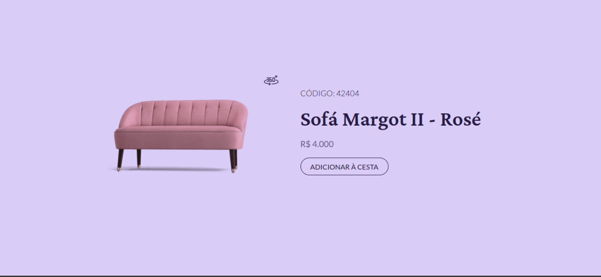

<h1 align="center"> Card de produto</h1>

    

## Desafio #02 - um card de produto

Desenvolva o card de produto conforme especificado utilizando as tecnologias da sua preferência. O arquivo do Figma contém um protótipo e o link para baixar o arquivo .gif a ser utilizado.

